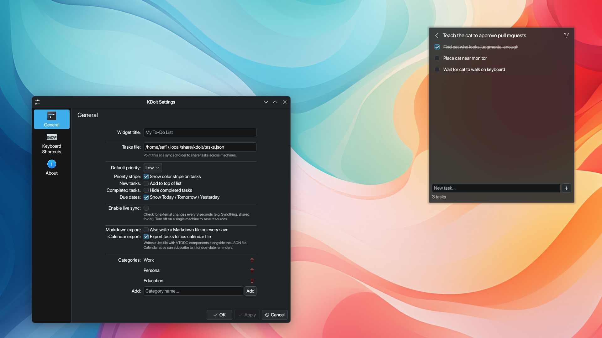

# KDoit

A to-do list widget for KDE Plasma 6. Pure QML, no build step.

Nested sublists, priorities, due dates, categories, drag-and-drop reorder, live file sync, Markdown export (Obsidian Tasks compatible), and iCalendar export for calendar apps.

 

## Why KDoit

- **No build step** — clone and install in under a minute; no cmake, no npm
- **Your data** — tasks live in `~/.local/share/kdoit/tasks.json`; no account, no cloud
- **Sync your way** — works with Syncthing, Nextcloud, or any file sync tool
- **iCalendar export** — subscribe to due-date reminders in any calendar app
- **Obsidian bridge** — Markdown export is compatible with the Obsidian Tasks plugin
- **Plasma 6 native** — Kirigami theme colors, no hardcoded values

## Install

```bash
git clone https://github.com/lubdhak7414/KDoit.git
kpackagetool6 -t Plasma/Applet -i KDoit/
```

Then right-click the desktop → Add Widgets → search "KDoit".

Requires KDE Plasma 6 (Kirigami and Qt 6 are included in any standard Plasma 6 install). Works on Wayland and X11.

## Features

**Task management**
- Priorities: high / medium / low with a color-coded stripe
- Due dates — today and overdue tasks are highlighted
- Categories — filter via the header dropdown
- Nested sublists — one level deep; click the count badge to enter
- Drag-and-drop reorder (disabled while filtering or inside a sublist)
- Multi-select: Ctrl+click toggle, Shift+click range, bulk delete
- Undo on delete — 5-second window
- Right-click any task for rename, date, category, priority

**Data and sync**
- Dual-write: JSON file + KConfig mirror for instant startup
- Live sync: polls the file every 3 s and merges by UUID (newer `modifiedAt` wins); propagates remote deletions

**Export**
- **Markdown** — checkbox format with UUID and metadata comments; compatible with the Obsidian Tasks plugin
- **iCalendar** — `.ics` file with RFC 5545 VTODO components; subtasks linked via `RELATED-TO`

## Configuration

Right-click the widget → Configure:

| Setting | Default | Notes |
|---------|---------|-------|
| Storage path | `~/.local/share/kdoit/tasks.json` | Point multiple machines at the same synced folder |
| Default priority | Medium | Priority assigned to new tasks |
| Hide completed | Off | Collapses done tasks from view |
| Add to top | Off | Inserts new tasks at the top instead of the bottom |
| Live sync | Off | Enable only when sharing the file across machines |
| Markdown export | Off | Writes a `.md` file alongside the JSON |
| iCalendar export | Off | Writes a `.ics` file alongside the JSON |

## Sync across machines

Point all machines at the same file via Syncthing (or any sync tool) and enable **Live sync** in Configure. The 3-second poll picks up remote writes; UUID-based merge applies the newer version of each task and propagates deletions.

## iCalendar export

When enabled, KDoit writes `tasks.ics` next to `tasks.json`. Only tasks with due dates are exported. Import it into Thunderbird, GNOME Calendar, or subscribe via any CalDAV client for due-date reminders.

## FAQ

**Does it work on X11 and Wayland?**
Yes.

**Can I use KDoit without a KDE desktop?**
No — it's a Plasma plasmoid and requires KDE Plasma 6.

**Does it sync with Todoist, Notion, or other cloud apps?**
Not directly. It writes a standard JSON file you can sync with any tool. The iCalendar export works with any CalDAV-compatible app.

**Is there a Flatpak or Snap?**
No. Plasmoids install via `kpackagetool6` and run inside the Plasma shell.

## Contributing

See [CONTRIBUTING.md](CONTRIBUTING.md).

## License

GPL v3 — see [LICENSE](LICENSE).
